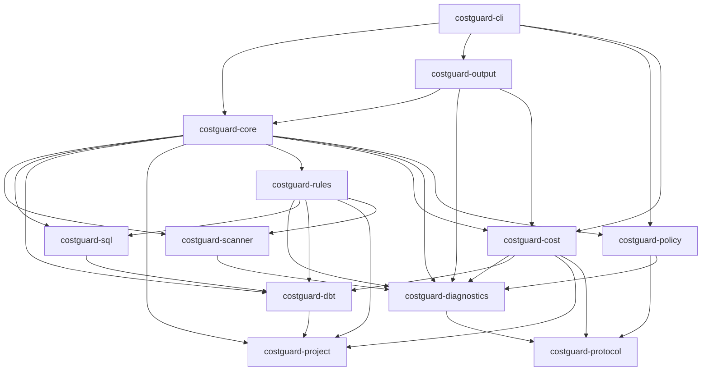
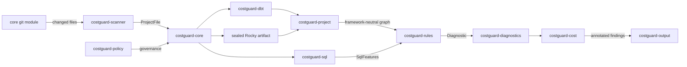

# Architecture

Costguard is a Rust workspace of 12 crates. The CLI delegates to `costguard-core`, which orchestrates file discovery, framework metadata, SQL parsing, rule evaluation, cost annotation, and output rendering.

## Crate dependency graph



## Scan data flow



A typical `costguard pr` run:

1. **Configuration** — one resolver applies defaults, file configuration, command settings, explicit overrides, normalization, and validation.
2. **Git** — `costguard-core` resolves changed files, preflights every base object and the aggregate budget, then streams approved blobs from the immutable base commit.
3. **Scanner** — `costguard-scanner` classifies files (SQL, dbt YAML, Python, manifest).
4. **Framework metadata + SQL** — `costguard-dbt` loads manifest/YAML, `costguard-core` verifies sealed Rocky compile metadata, `costguard-project` merges both into an internal framework-neutral graph, and `costguard-sql` parses analysis SQL under an explicit AST/regex merge policy.
5. **Rules** — `costguard-rules` evaluates 47 SQLCOST rules against each file's `RuleContext`.
6. **Policy + baseline** — `costguard-core` applies signed policy and finding baselines.
7. **Cost** — `costguard-cost` keeps internal USD/month and bytes/month estimates in distinct newtypes and converts to public schema-v4 fields only at compatibility boundaries.
8. **Output** — `costguard-output` renders text, JSON, GitHub annotations, markdown, or SARIF; typed receipt comparison and shared presentation decisions live here.

## Crate responsibilities

- **costguard-cli** — Thin binary entry point, separate Clap root, and command dispatch/handlers for `scan`, `explain`, `pr`, `rocky`, `cost`, `rules`, `policy`, `init`, and `doctor`.
- **costguard-core** — Scan orchestration, configuration resolution, readiness facts, baseline management, budgeted git integration for PR scans, `ScanResult`.
- **costguard-scanner** — File discovery, classification, and size/ignore filtering.
- **costguard-sql** — Warehouse enum, sqlparser dialect mapping, Jinja stripping, feature extraction.
- **costguard-dbt** — Manifest JSON, YAML schema, `dbt_project.yml` folder configs, model graph.
- **costguard-project** — Framework-qualified dbt/Rocky model metadata and dependency indexes used by core orchestration.
- **costguard-rules** — 47 SQLCOST rules, `RuleRegistry`, per-rule overrides.
- **costguard-diagnostics** — `Diagnostic`, severity, confidence, spans, inline suppressions.
- **costguard-cost** — Lognormal cost model, catalog/query-history import, savings attribution.
- **costguard-output** — Result rendering in five output formats (JSON schema v4).
- **costguard-policy** — Ed25519 signed policy compile/sign/verify/resolve/enforce.
- **costguard-protocol** — Shared JSON schema types (`SignedDocumentV1`, `EnforcementOutcome`, etc.).

## Building API docs locally

```bash
RUSTDOCFLAGS="-D warnings" cargo doc --workspace --no-deps --open
```

The mdBook site (including this page) builds with:

```bash
python3 scripts/generate_rule_docs.py && mdbook build
```
