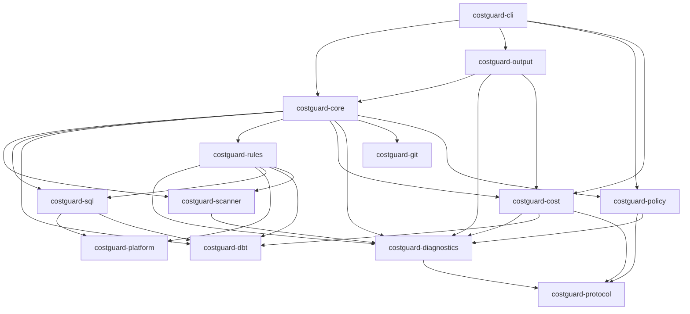
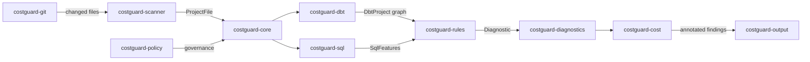

# Architecture

Costguard is a Rust workspace of 13 crates. The CLI delegates to `costguard-core`, which orchestrates file discovery, SQL/dbt parsing, rule evaluation, cost annotation, and output rendering.

## Crate dependency graph



## Scan data flow



A typical `costguard pr` run:

1. **Git** — `costguard-git` resolves changed files against the base branch.
2. **Scanner** — `costguard-scanner` classifies files (SQL, dbt YAML, Python, manifest).
3. **dbt + SQL** — `costguard-dbt` loads manifest/YAML; `costguard-sql` parses SQL and extracts shape features.
4. **Rules** — `costguard-rules` evaluates 44 SQLCOST rules against each file's `RuleContext`.
5. **Policy + baseline** — `costguard-core` applies signed policy and finding baselines.
6. **Cost** — `costguard-cost` attaches advisory cost estimates when configured.
7. **Output** — `costguard-output` renders text, JSON, GitHub annotations, markdown, or SARIF.

## Crate responsibilities

- **costguard-cli** — Clap CLI: `scan`, `explain`, `pr`, `cost`, `rules`, `baseline`, `policy`.
- **costguard-core** — Scan orchestration, configuration loading, baseline management, `ScanResult`.
- **costguard-scanner** — File discovery, classification, and size/ignore filtering.
- **costguard-sql** — Jinja stripping, sqlparser dialect parsing, feature extraction.
- **costguard-dbt** — Manifest JSON, YAML schema, `dbt_project.yml` folder configs, model graph.
- **costguard-rules** — 44 SQLCOST rules, `RuleRegistry`, per-rule overrides.
- **costguard-diagnostics** — `Diagnostic`, severity, confidence, spans, inline suppressions.
- **costguard-cost** — Lognormal cost model, catalog/query-history import, savings attribution.
- **costguard-output** — Result rendering in five output formats (JSON schema v4).
- **costguard-git** — Changed-file detection for PR-scoped scans.
- **costguard-platform** — Warehouse enum and sqlparser dialect mapping.
- **costguard-policy** — Ed25519 signed policy compile/sign/verify/resolve/enforce.
- **costguard-protocol** — Shared JSON schema types (`SignedDocumentV1`, `EnforcementOutcome`, etc.).

## Building API docs locally

```bash
RUSTDOCFLAGS="-D warnings" cargo doc --workspace --no-deps --open
```

The mdBook site (including this page) builds with:

```bash
python3 scripts/generate_rule_docs.py && mdbook build
```
