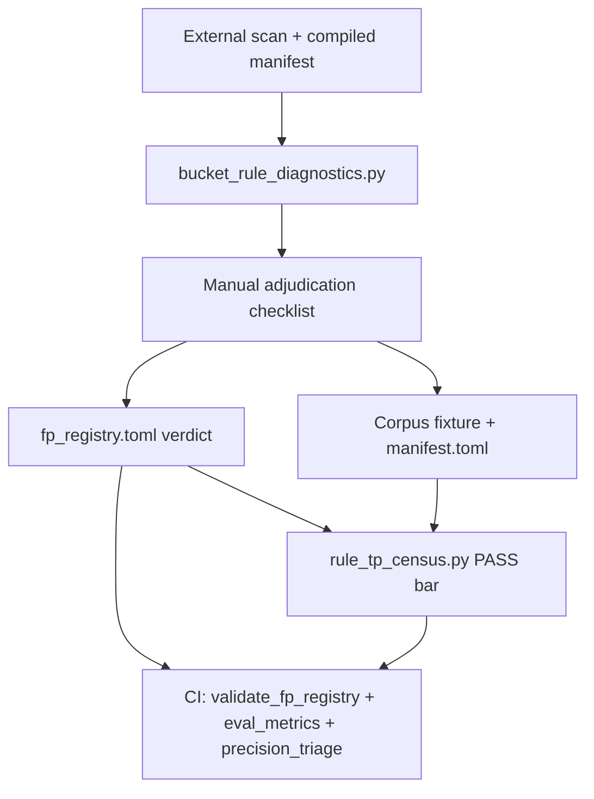

# Manual rule review playbook

Costguard ships 47 rules (`SQLCOST001`–`SQLCOST047`). Automated corpus tests prove each behavioral rule *can* fire and *can* stay silent on authored negatives, but real projects surface patterns that require human judgment: bucket-specific exemptions, compiled-SQL-only signals, and repo idioms that regex classifiers approximate. `SQLCOST045` (stale dbt manifest), `SQLCOST046` (manifest checksum mismatch), and `SQLCOST047` (Rocky artifact integrity) are metadata-state markers validated by integration tests, not the cost-pattern census.

This document is the **canonical workflow** for manually reviewing rule findings, recording verdicts, and closing the loop with code fixes or registry entries. Outcome scoreboards live in [Rule TP coverage](rule-tp-coverage.md) (44 cost/behavioral rules, `SQLCOST001`–`SQLCOST044`; `SQLCOST045`–`SQLCOST047` excluded); Spellbook cost triage case studies live in [Spellbook top-10 cost review](spellbook-top10-cost-review.md).

## What “working properly” means

A rule is considered validated when **all** of the following hold:

| Layer | Artifact | Pass bar |
| --- | --- | --- |
| Corpus contracts | [`tests/fixtures/corpus/manifest.toml`](../../tests/fixtures/corpus/manifest.toml) | ≥2 `expect_rules` + ≥1 `forbid_rules` per behavioral rule (`recall_report.py`) |
| Registry integrity | [`tests/benchmarks/fp_registry.toml`](../../tests/benchmarks/fp_registry.toml) | Every bucket verdict anchors to a corpus case; `verdict = "fp"` rows require `class = "exempt"` or `"bug"` (`validate_fp_registry.py`) |
| Corpus metrics | [`tests/benchmarks/eval_labels.toml`](../../tests/benchmarks/eval_labels.toml) | Precision/recall/MCC = 1.0 on corpus split (`eval_metrics.py --split corpus`) |
| FP-elimination census | [`scripts/rule_tp_census.py`](../../scripts/rule_tp_census.py) | **≤100 cost-ranked examples per rule** (100% if fewer): **0 `fp_bug` + 0 `unknown`** in the examined sample |
| Spellbook precision (optional gate) | [`scripts/precision_triage.py`](../../scripts/precision_triage.py) | ≥90% high-severity, ≥80% overall, ≥70% per classified rule |

Infrastructure rules (`SQLCOST023`–`SQLCOST027`) are excluded from behavioral census; they auto-pass as `infrastructure_na`.

### Vocabulary

| Term | Meaning |
| --- | --- |
| **TP** | True positive — finding matches the rule rubric and represents real cost risk |
| **Exempt** | Documented repo-specific-valid pattern (`verdict = "fp"`, `class = "exempt"`) — acceptable in census |
| **FP bug** | Rule misfire (`verdict = "fp"`, `class = "bug"`, or unmarked) — must be eliminated via rule fix |
| **Unknown** | Finding bucket has no entry in `fp_registry.toml` for that `(repo, rule, bucket)` |
| **Bucket** | Regex/AST-derived sub-classification of a finding’s compiled SQL (see [Bucket classifiers](#bucket-classifiers)) |
| **Review artifact** | Registry row, corpus case, or evidence snippet — human-recorded judgment |
| **Scanner output** | Raw diagnostic count in benchmark baselines — may rise when detection improves even after FP fixes |

Do not conflate **census totals** (sum across spellbook + jaffle-shop + mattermost-warehouse + data-infra) with **single-repo baseline counts**.

## Review pipeline



## Prerequisites

1. **Cached benchmark checkout** with compiled manifest:
   ```bash
   python3 scripts/benchmark_external_repo.py --repo spellbook
   ```
   Default cache: `~/.cache/costguard/benchmarks/{repo}/`. Pins are in [`tests/benchmarks/repos.toml`](../../tests/benchmarks/repos.toml).

   The rule-review census repos set `compile_dbt = true`. Spellbook and jaffle-shop compile offline with dummy Trino/DuckDB profiles. **mattermost-warehouse** and **data-infra** set `compile_best_effort = true`: when Snowflake/BigQuery auth fails offline, the harness reuses any existing `target/manifest.json` instead of aborting the scan. The broader support matrix also includes required NBA Monte Carlo and Tuva external benchmarks. Prefer compiled SQL for adjudication; reserve `class = "exempt"` for genuine repo idioms, not regex-only artifacts masked because compile was disabled.

2. **Read compiled SQL**, not raw Jinja, for dbt models. All triage scripts use `read_sql_for_diagnostic()` — manifest `compiled_code` when available.

3. **Rule rubric** for the rule under review: [`docs/rules/SQLCOST*.md`](../rules/).

4. **Release binary** (scripts default to `target/release/costguard`):
   ```bash
   cargo build -p costguard-cli --release
   ```

## Step-by-step adjudication loop

For each finding (or bucket batch):

1. **Run or reuse a scan**
   - Full census: `python3 scripts/rule_tp_census.py --repos spellbook jaffle-shop mattermost-warehouse data-infra`
   - Single rule buckets: `python3 scripts/bucket_rule_diagnostics.py --repo spellbook --rule SQLCOST012`
   - Cost-ranked queue: `python3 scripts/top_findings_review.py --repo spellbook --top 50`

2. **Identify rule, path, line** from diagnostic JSON or script output.

3. **Load compiled SQL** at the finding line (manifest-backed). Read ±10 lines of context.

4. **Assign a bucket** — run the rule’s classifier from [`scripts/bucket_rule_diagnostics.py`](../../scripts/bucket_rule_diagnostics.py) or trust the script’s bucket column.

5. **Apply the rule rubric** ([`docs/rules/`](../rules/)). Ask:
   - Does the failure condition in the rubric actually apply to this SQL?
   - Is there an documented exemption (time-bucket join, append incremental, CTE broadcast, macro template)?
   - Is the feature extractor wrong (comment prose, subquery alias as catalog, homonym CTE)?

6. **Decide verdict**: `tp`, `exempt` (`verdict = "fp"`, `class = "exempt"`), `bug` (must fix rule), or `uncertain` (treat as blocking).

7. **Record the outcome** (see [Fix-or-register decision tree](#fix-or-register-decision-tree)).

8. **Re-run validation** (see [CI validation checklist](#ci-validation-checklist)).

### Manual checklist (copy per finding)

- [ ] Compiled SQL loaded from manifest
- [ ] Rule rubric read (`docs/rules/SQLCOSTnnn.md`)
- [ ] Bucket assigned and matches SQL shape
- [ ] Verdict: TP / exempt / bug / uncertain
- [ ] If exempt/TP pattern recurs: registry row with `corpus_case` (`class = "exempt"` when `verdict = "fp"`)
- [ ] If universal bug: Rust fix + unit test + corpus `forbid_rules`
- [ ] Baselines refreshed if diagnostic counts changed intentionally
- [ ] Census and registry validators green

## Artifact contracts

### `fp_registry.toml`

Machine-readable bucket verdicts. Schema per `[[finding]]` block:

| Field | Required | Description |
| --- | --- | --- |
| `rule` | yes | e.g. `SQLCOST012` |
| `repo` | yes | Benchmark repo name (`spellbook`, `jaffle-shop`, …) |
| `bucket` | yes | Classifier output or `other` |
| `verdict` | yes | `tp` or `fp` |
| `class` | required when `verdict = "fp"` | `exempt` (documented repo-valid pattern) or `bug` (must fix rule) |
| `corpus_case` | yes | Name of a case in [`tests/fixtures/corpus/manifest.toml`](../../tests/fixtures/corpus/manifest.toml) |
| `notes` | recommended | Human rationale for the next reviewer |

**Contract:** `verdict = "fp"` rows must reference a corpus case whose `forbid_rules` includes the rule. `verdict = "tp"` rows must reference a case whose `expect_rules` includes the rule. Validated by [`scripts/validate_fp_registry.py`](../../scripts/validate_fp_registry.py).

Example:

```toml
[[finding]]
rule = "SQLCOST012"
repo = "spellbook"
bucket = "cross_join_unnest"
verdict = "fp"
class = "exempt"
corpus_case = "cross_join_unnest"
notes = "UNNEST and table-function cross joins are intentional in Spellbook"
```

At most one verdict per `(repo, rule, bucket)` triple.

### Bucket classifiers

Nineteen rules have regex/AST bucket classifiers in [`scripts/bucket_rule_diagnostics.py`](../../scripts/bucket_rule_diagnostics.py) (`CLASSIFIERS` dict). All other rules classify as `"other"`.

| Rule | Classifier function | Typical buckets |
| --- | --- | --- |
| SQLCOST002 | `classify_sqlcost002` | `repeated_json`, `other` |
| SQLCOST003 | `classify_sqlcost003` | `repeated_regex`, `other` |
| SQLCOST005 | `classify_sqlcost005` | `block_time_predicate`, `date_predicate`, `missing_predicate`, … |
| SQLCOST006 | `classify_sqlcost006` | `equality_join`, `non_equality_join`, `other` |
| SQLCOST008 | `classify_sqlcost008` | `blind_distinct`, `distinct_with_group_by` |
| SQLCOST012 | `classify_sqlcost012` | `cross_join_explicit`, `comma_join`, `cross_join_unnest`, `subquery_comma_fp`, … |
| SQLCOST013 | `classify_sqlcost013` | `empty_partition_by`, `other` |
| SQLCOST014 | `classify_sqlcost014` | `repeated_cte_ref`, `other` |
| SQLCOST015 | `classify_sqlcost015` | `json_expression`, `normalization_expression`, `single_file_guard`, `other` |
| SQLCOST016 | `classify_sqlcost016` | `date_trunc_filter`, … |
| SQLCOST017 | `classify_sqlcost017` | `lower_trim`, `date_trunc_join`, `coalesce_key`, `symmetric_normalize`, … |
| SQLCOST018 | `classify_sqlcost018` | `union_without_all`, `other` |
| SQLCOST019 | `classify_sqlcost019` | `no_where_on_source`, `block_time_in_source_scope`, `macro_wrapped`, … |
| SQLCOST020 | `classify_sqlcost020` | `count_distinct`, `other` |

**Registered buckets in `fp_registry.toml`** (93 entries as of 2026-07-01) — source of truth for verdicts:

| Rule | Registered `(repo, bucket, verdict)` patterns |
| --- | --- |
| SQLCOST001 | spellbook/other → tp |
| SQLCOST002 | jaffle-shop/repeated_json → tp; spellbook/repeated_json, other → tp |
| SQLCOST003 | spellbook/repeated_regex, other → tp |
| SQLCOST004 | spellbook/append_strategy, yaml_unique_key, dbt_project_unique_key → fp; other → tp |
| SQLCOST005 | block_time, date, unique_key, config, date_trunc → fp; missing_predicate, other → tp |
| SQLCOST006 | equality_join → fp; non_equality_join, other → tp |
| SQLCOST007 | spellbook/other → tp |
| SQLCOST008 | blind_distinct → tp; distinct_with_group_by → fp |
| SQLCOST012 | cross_join_unnest, date_spine, string_literal, subquery_comma, group_by_comma, other → fp; explicit/comma cross → tp |
| SQLCOST013 | empty_partition_by, other → tp |
| SQLCOST014 | other → fp; repeated_cte_ref → tp |
| SQLCOST015 | json/normalization/other → tp; single_file_guard → fp |
| SQLCOST016 | date_trunc_filter → fp |
| SQLCOST017 | lower_trim, date_trunc_join, coalesce_key, symmetric_normalize, other → fp; cast_on_key → tp |
| SQLCOST018 | union_without_all, other → tp |
| SQLCOST019 | no_where, block_time scopes, macro_wrapped, other → tp |
| SQLCOST020 | count_distinct → tp |
| SQLCOST028–044 | spellbook/other → tp (platform-specific rules also fire on data-infra / mattermost) |

When census reports **unknown buckets**, either add a registry row (after manual TP/FP decision) or extend the classifier in `bucket_rule_diagnostics.py`.

### `rule_tp_evidence.json`

Generated by `python3 scripts/rule_tp_census.py --emit-evidence`. Per-rule structure:

```json
{
  "SQLCOST012": {
    "pass": true,
    "pass_reason": "fully_examined",
    "total": 40,
    "examined": 40,
    "tp": 20,
    "exempt": 20,
    "fp_bug": 0,
    "unknown": 0,
    "examined_examples": [
      {
        "repo": "spellbook",
        "path": "dbt_subprojects/.../model.sql",
        "line": 42,
        "bucket": "comma_join",
        "verdict": "tp",
        "class": null,
        "label": "tp",
        "savings": 960.0,
        "message": "...",
        "snippet": "..."
      }
    ]
  }
}
```

- **`examined_examples`**: Up to 100 cost-ranked findings per rule for spot-check audits.
- **`exempt` / `fp_bug` / `unknown`**: Counts within the examined sample only.
- Do not duplicate this file into markdown; cite it as the live evidence store.

### Corpus fixtures

Minimal reproducible cases under [`tests/fixtures/corpus/`](../../tests/fixtures/corpus/). Each case in `manifest.toml` lists `expect_rules` and/or `forbid_rules`. Prefer extracting a 10–30 line fixture when:

- The pattern will recur in CI forever
- A rule fix must not regress
- `fp_registry.toml` needs a stable `corpus_case` anchor

See [Corpus fixtures](../book/contributing/corpus-fixtures.md).

## Review workflows by goal

| Goal | Command | Pass criteria |
| --- | --- | --- |
| Per-rule FP elimination (4 repos) | `python3 scripts/rule_tp_census.py --emit-evidence` | 44/44 PASS — see [rule-tp-coverage.md](rule-tp-coverage.md) |
| Single-rule iteration | `python3 scripts/rule_tp_census.py --rule SQLCOST012 --sample-cap 100` | 0 fp_bug + 0 unknown in sample |
| Cost-prioritized triage | `python3 scripts/top_findings_review.py --repo spellbook --top 250` | Reviewed set matches registry TP |
| Bucket distribution | `python3 scripts/bucket_rule_diagnostics.py --repo spellbook --rule SQLCOST017 --json-out triage/017.json` | No unknown buckets remain unadjudicated |
| Sampled precision | `python3 scripts/precision_triage.py --repo spellbook --sample-size 200` | ≥90% / ≥80% / ≥70% gates |
| Corpus gold metrics | `.venv-eval/bin/python scripts/eval_metrics.py --split corpus` | MCC = 1.0 |
| Real-split metrics | `.venv-eval/bin/python scripts/eval_metrics.py --split real` | Soft floors; labels from registry |
| Registry ↔ corpus | `python3 scripts/validate_fp_registry.py` | Exit 0 |
| Recall coverage | `python3 scripts/recall_report.py` | ≥2 expect + ≥1 forbid per rule |

See also [Classification metrics](classification-metrics.md) and [Scripts reference — triage tools](../book/reference/scripts.md).

## Fix-or-register decision tree

```
Finding reviewed
       │
       ├─ Universal safe exemption? (macros, GROUP BY dedup, CTE broadcast, comment masking)
       │     └─ YES → Fix rule in costguard-rules / costguard-sql
       │              + unit test + corpus forbid_rules case
       │              + regenerate baselines
       │
       ├─ Repo-specific valid pattern? (Spellbook time-bucket join, append incremental)
       │     └─ YES → fp_registry.toml verdict = "fp" + corpus_case anchor
       │              (+ optional classifier tweak in bucket_rule_diagnostics.py)
       │
       ├─ Rule correctly fires on recurring pattern?
       │     └─ YES → fp_registry.toml verdict = "tp" (often bucket = "other")
       │
       └─ Feature extractor bug? (wrong catalog, homonym CTE, compiled vs raw mismatch)
             └─ YES → Fix extractor + regression test
                      + re-triage affected bucket
```

### Prefer a rule fix when

- The exemption is **warehouse- and repo-neutral** (skip `/macros/`, skip `DISTINCT` when `GROUP BY` present, mask comments before JSON regex).
- Letting the finding stand would flood every dbt project.
- Document with `forbid_rules` in corpus so CI catches regressions.

### Prefer a registry FP bucket when

- The idiom is **domain-valid** in a benchmark repo but not universally wrong (e.g. `CROSS JOIN UNNEST` in Spellbook, coalesce null-safe joins).
- A rule fix would over-exempt and hide real TPs elsewhere.

### Prefer a registry TP bucket when

- The rule fires correctly but reviewers need a standing record (`other` bucket TP entries for SQLCOST038 fan-out joins, SQLCOST042 partition filters on data-infra).

### Residual FP policy

Census **PASS** requires **zero `fp_bug` and zero `unknown`** in the cost-ranked examined sample (≤100 findings per rule). Documented repo-specific exemptions (`class = "exempt"`) count separately and are acceptable.

Pay down `class = "bug"` registry rows and unknown buckets via rule fixes or new registry adjudication. Track progress in [rule-tp-coverage.md](rule-tp-coverage.md).

## 2026-06 review sprint (summary)

Work completed in two phases; full narratives are linked, not duplicated here.

### Phase 1 — Spellbook cost triage (top 250)

- **Script:** [`scripts/top_findings_review.py`](../../scripts/top_findings_review.py)
- **Doc:** [Spellbook top-10 cost review](spellbook-top10-cost-review.md)
- **Fixes:** SQLCOST015 comment masking; SQLCOST035 subquery catalog; SQLCOST014 CTE homonyms; SQLCOST008 GROUP BY; SQLCOST012 CTE broadcast; SQLCOST006/014 macro skips
- **Outcome:** Top 250 cost-ranked findings → 250/250 registry TP

### Phase 2 — 44-rule census (all benchmark repos)

- **Script:** [`scripts/rule_tp_census.py`](../../scripts/rule_tp_census.py)
- **Doc:** [Rule TP coverage](rule-tp-coverage.md)
- **Fixes:** SQLCOST016 range-only `date()` exempt; SQLCOST017 coalesce/time-bucket joins; SQLCOST001/004/005/007/028 registry `other` buckets; platform rules on data-infra (SQLCOST028, SQLCOST042)
- **Outcome:** 44/44 PASS; evidence in [`tests/benchmarks/rule_tp_evidence.json`](../../tests/benchmarks/rule_tp_evidence.json)

### Phase 3 — Root-cause FP reduction (compile + SQLCOST006)

- **Harness:** `compile_dbt = true` for mattermost-warehouse and data-infra; `compile_best_effort` tolerant compile in [`scripts/dbt_compile_for_costguard.py`](../../scripts/dbt_compile_for_costguard.py)
- **Rule fixes:** SQLCOST006 emits `confidence: low` on regex-only extraction; symmetric coalesce/cast equality keys in AST; subquery join `ON` detection after balanced `(`…`)`
- **Outcome:** SQLCOST006 total 99→98, exempt 32→31; 44/44 census PASS

### Phase 4 — Tail review and residual precision fixes

- **Harness:** `rule_tp_census.py --emit-stratified-evidence` samples unreviewed high-volume tails by `(repo, rule, bucket)`.
- **Rule fixes:** regex fallback equality detection for range-plus-equality joins; `USING (...)` equality handling; nested symmetric `trim(lower(...))` joins; generated date-range CTE names; single-quoted string masking in comma-join fallback.
- **Outcome:** SQLCOST006 total 75→38 and exemptions 16→5 in refreshed evidence; SQLCOST012 exemptions 20→17; supplemental behavioral tails have 0 `fp_bug` and 0 `unknown`; SQLCOST027 top parse-marker source patterns are documented in [Rule TP coverage](rule-tp-coverage.md#supplemental-tail-review).

### Optional second rater

Local LLM judge pipeline for inter-rater reliability — does **not** replace registry adjudication. See [LLM judge IRR](llm-judge-irr.md).

## CI validation checklist

Run after any registry, corpus, or rule change:

```bash
# Registry and recall (always in ci_local.sh)
python3 scripts/validate_fp_registry.py
python3 scripts/recall_report.py

# Corpus classification (hard gate)
python3 -m venv .venv-eval && .venv-eval/bin/pip install --require-hashes -r requirements-eval.lock
.venv-eval/bin/python scripts/eval_metrics.py --split corpus
.venv-eval/bin/python scripts/eval_irr.py --check

# Full-corpus rule census (manual before merging large triage PRs)
python3 scripts/rule_tp_census.py --emit-evidence

# External baselines (after intentional count changes)
python3 scripts/benchmark_external_repo.py --repo spellbook --update-baseline
python3 scripts/benchmark_external_repo.py --repo jaffle-shop --update-baseline

# Spellbook precision (ci_local.sh --precision)
python3 scripts/precision_triage.py --repo spellbook --sample-size 200
.venv-eval/bin/python scripts/eval_metrics.py --split real
```

Full local gate: `./scripts/ci_local.sh` (add `--precision`, `--spellbook-smoke`, `--nba-monte-carlo-smoke` as needed).

## Why diagnostic counts can rise after FP fixes

Improved compiled-SQL feature extraction (especially fan-out join catalog for **SQLCOST038**) can add many **true positives** faster than FP fixes remove noise. The census commit reduced Spellbook from 5,143 → 4,756 findings while still above an earlier 3,644 baseline — net increase reflects better detection, not failed triage. See census scoreboard for per-rule deltas.

## Related docs

- [Rule TP coverage](rule-tp-coverage.md) — 44/44 PASS scoreboard
- [Benchmark calibration](benchmark-calibration.md) — four-layer benchmark model
- [Classification metrics](classification-metrics.md) — eval_labels and sklearn gates
- [Spellbook top-10 cost review](spellbook-top10-cost-review.md) — cost-ranked case studies
- [LLM judge IRR](llm-judge-irr.md) — optional second rater
- [Scripts reference](../book/reference/scripts.md) — CLI flags for triage tools
- [Contributing — Manual rule review](../book/contributing/manual-rule-review.md) — short mdBook pointer
